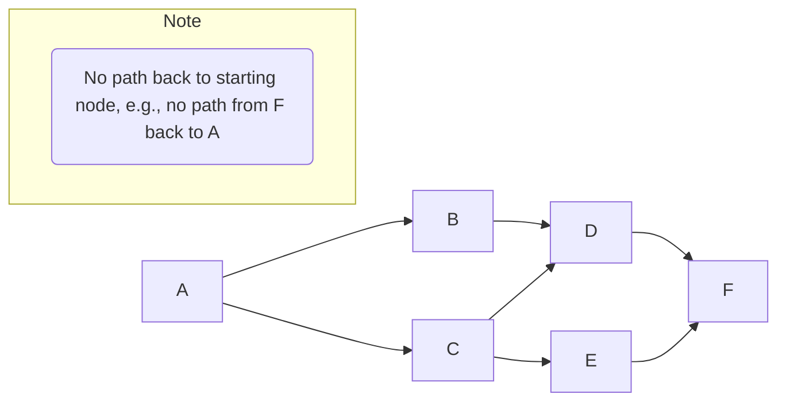

---
tags:
  - data_structures
  - concept
  - graph_theory
aliases:
  - Directed Acyclic Graph
related:
  - Graph_DS
  - Tree_DS
  - Cycle_Detection
  - Topological_Sort
worksheet:
  - WS9
date_created: 2025-04-14
---
# Directed Acyclic Graph (DAG)

## Definition

A **Directed Acyclic Graph (DAG)** is a type of directed [[Graph_DS|graph]] that contains **no directed cycles**. This means that for any given node (vertex) in the graph, there is no directed path that starts and ends at that same node by following the directed edges.

## Key Aspects / Characteristics

- **Directed Edges:** Connections between nodes (vertices) have a direction (A -> B is different from B -> A).
- **Acyclic:** Contains no directed cycles. It's impossible to start at a node and follow a sequence of directed edges to return to the starting node.
- **Relationship to Trees:** [[Tree_DS|Trees]] are a specific, more restricted type of DAG (where each node except the root has exactly one incoming edge). DAGs can have nodes with multiple incoming edges.
- **Topological Sorting:** A key property of DAGs is that they can be **topologically sorted**. This means their vertices can be arranged in a linear order such that for every directed edge from vertex `u` to vertex `v`, `u` comes before `v` in the ordering. Topological sorting is impossible if the graph contains a cycle.

## Visualization

*This is a DAG. Adding an edge F --> A would create a cycle (A->C->E->F->A) and it would no longer be a DAG.*

## Use Cases / Real-World Examples

- **Dependency Management:** Representing dependencies between tasks, software packages, or build steps. A topological sort gives a valid order of execution/installation. (e.g., Makefiles, package managers).
- **Scheduling:** Project scheduling (PERT charts), course prerequisites.
- **Version Control:** [[Git]]'s commit history forms a DAG (commits point to parents, merge commits have multiple parents, cycles are generally disallowed/problematic).
- **Data Processing Pipelines:** Representing stages of data transformation where output of one stage feeds into others.
- **Compiler Optimization:** Representing expression dependencies (Directed Acyclic Word Graph - DAWG).
- **Genealogy/Citation Networks:** Representing ancestry or citation relationships (usually acyclic).

## Related Concepts
- [[Graph_DS]] (DAG is a type of graph)
- [[Tree_DS]] (A specific type of DAG)
- [[Cycle_Detection]] (Algorithms to check if a graph is acyclic)
- [[Topological_Sort]] (An ordering possible only for DAGs)
- [[Git]] Commit History

---
**Source:** Worksheet WS9