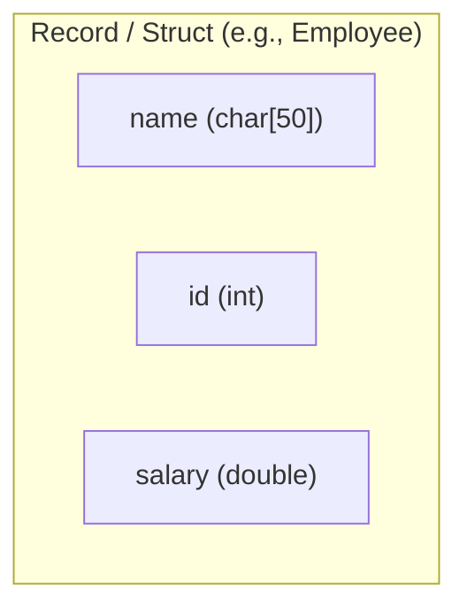

---
tags:
  - data_structures
  - concept
  - basic
  - composite
aliases:
  - Record
  - Struct (Data Structure Context)
related:
  - "[[Data_Structure]]"
  - "[[struct_C]]"
  - "[[Union_DS]]"
  - "[[Tuple_Python]]"
  - "[[Object_Oriented_Programming]]"
worksheet:
  - WS7
date_created: 2025-04-12
---
# Record (Data Structure)

## Definition

A **Record** (also commonly known as a **Structure** or `struct` in languages like C/C++, or sometimes related to tuples or objects) is a basic composite [[Data_Structure]] consisting of a collection of **fields** or **members**, potentially of different data types, typically stored in a fixed number and sequence. Each field has a name and a data type.

## Key Aspects / Characteristics

- **Composite:** Groups multiple data items together.
- **Heterogeneous:** Fields can be of different types (unlike an array which is homogeneous).
- **Named Fields:** Each data item within the record is accessed by its name (e.g., `employee.name`, `point.x`).
- **Fixed Structure:** Typically, the number, names, and types of fields are fixed when the record type is defined.
- **Contiguous Memory (Often):** In languages like C, the fields of a struct are usually stored in a contiguous block of memory (possibly with [[Padding_C]]).
- **Representation:** Used to represent real-world entities or data groupings (e.g., an employee record with name, ID, salary; a coordinate point with x, y, z values).

## Implementation Examples

- **C/C++:** Uses the `struct` keyword. See [[struct_C]].
- **Python:** Can be represented using `tuple` (immutable), `dict` (key-value), custom classes, or `dataclasses`/`namedtuple`.
- **Databases:** A row in a database table is analogous to a record, with columns representing fields.

## Visualization (Conceptual C struct)


*Memory Layout (Conceptual, with potential padding):*
```
+-------------------+-------+----------+---------+
| name[0]...name[49]| id    | padding? | salary  |
+-------------------+-------+----------+---------+
```

## Related Concepts
- [[Data_Structure]]
- [[struct_C]] (C implementation)
- [[Union_DS]] (Alternative composite type where members share memory)
- [[Tuple_Python]] (Similar immutable structure in Python)
- [[Object_Oriented_Programming]] (Objects often encapsulate data similar to records, but also include methods)
- Database Records/Rows

---
**Source:** Worksheet WS7