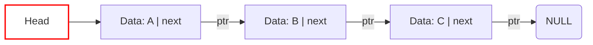

---
tags:
  - data_structures
  - concept
  - implementation
  - list
  - linked_list
aliases:
  - Singly Linked List
  - SLL
related:
  - Data_Structure
  - Linked_List_ADT
  - Doubly_Linked_List_DS
  - Circular_Linked_List_DS
  - Node_DS
  - Pointer_C
  - Sequential_Access
  - Iterator_C
  - Dummy_Node_C
  - DAG
worksheet:
  - WS7
  - WS9
date_created: 2025-04-14
---
# Singly Linked List

## Definition

A **Singly Linked List** is a concrete [[Data_Structure]] implementation of a linear list ([[Linked_List_ADT]]) where elements (nodes) are linked together in a sequence using **one pointer per node**. Each node contains the data element and a pointer (`next`) that references the subsequent node in the list. The last node's `next` pointer typically points to `NULL`.

## Key Aspects / Characteristics

- **Node Structure:** Each node contains:
    - Data field(s).
    - A single pointer (`next`) to the next node in the list.
- **Head Pointer:** The list is accessed via a pointer (often called `head`) that points to the very first node. An empty list has a `head` pointer equal to `NULL`.
- **Unidirectional Traversal:** Traversal is only possible in one direction (forward) by following the `next` pointers from the head. You cannot easily go backward from a node to its predecessor.
- **[[Sequential_Access]]:** Accessing the Nth element requires traversing N nodes from the head (O(N) time complexity).
- **Insertion/Deletion:**
    - *At Head:* Very efficient (O(1)) - just update the `head` pointer.
    - *At Tail:* Requires traversing the entire list to find the last node (O(n)) unless a separate `tail` pointer is maintained (making append O(1)). Deletion at the tail still requires finding the *second-to-last* node (O(n)).
    - *In Middle:* Requires traversing to the node *before* the insertion/deletion point (O(n) search), but the actual pointer manipulation is O(1) once the location is found.
- **Memory:** Uses less memory per node compared to a [[Doubly_Linked_List_DS]] as only one pointer is stored.

## Node Structure (Conceptual C)

```c
typedef struct Node {
    DataType data; // Replace DataType with actual type (int, struct, etc.)
    struct Node *next;
} Node;

// List structure might just be a pointer to the head node
// typedef Node* LinkedList;
// Or a struct holding head (and maybe tail/size)
typedef struct {
    Node *head;
    // Node *tail; // Optional tail pointer
    // size_t size; // Optional size tracking
} LinkedList;
```

## Visualization



## Use Cases

- Implementing [[Stack_ADT|Stacks]] (push/pop at head are O(1)).
- Implementing [[Queue_ADT|Queues]] (if a `tail` pointer is also maintained, enqueue at tail and dequeue at head are O(1)).
- Situations where memory usage per node is critical and backward traversal is not needed.
- Representing sequences where insertions/deletions primarily happen at the beginning.
- Collision resolution in [[Hash_Table_DS]] using separate chaining.

## Related Concepts
- [[Data_Structure]], [[Linked_List_ADT]]
- [[Doubly_Linked_List_DS]], [[Circular_Linked_List_DS]] (Other list types)
- [[Node_DS]] (The building block)
- [[Pointer_C]] (The linking mechanism)
- [[Sequential_Access]]
- [[Iterator_C]] (Used for traversing)
- [[Dummy_Node_C]] (Technique to simplify edge cases)

---
**Source:** Worksheet WS7, WS9