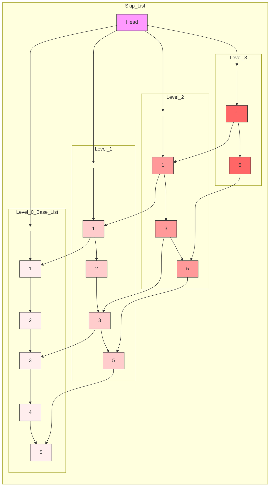

---
tags:
  - data_structures
  - concept
  - implementation
  - list
  - probabilistic
aliases:
  - Skip List
related:
  - "[[Data_Structure]]"
  - "[[Linked_List_ADT]]"
  - "[[Singly_Linked_List_DS]]"
  - "[[Balanced_Binary_Search_Tree_DS]]" # Competes with trees
  - "[[O_log_n]]"
  - "[[Probabilistic_Data_Structure]]"
worksheet: [WS7]
date_created: 2025-04-21
---
# Skip List

## Definition

A **Skip List** is a probabilistic [[Data_Structure]] based on [[Singly_Linked_List_DS|singly linked lists]] that allows for efficient search, insertion, and deletion operations, achieving **average [[O_log_n]] time complexity**, similar to balanced trees ([[Balanced_Binary_Search_Tree_DS]]), but often with simpler implementation logic.

## Key Aspects / Characteristics

- **Layered Linked Lists:** Consists of multiple levels (layers) of sorted linked lists.
- **Base Layer:** The bottommost layer (Level 0) is a standard sorted singly linked list containing all the elements.
- **Higher Layers:** Each subsequent layer acts as an "express lane," containing a subset of the nodes from the layer below it. A node present in layer `i` has a certain probability (typically 1/2 or 1/4) of also being present in layer `i+1`.
- **Node Structure:** Each node contains:
    - Data (key/value).
    - An array or list of `next` pointers, one for each level the node participates in. The number of levels for a node is usually determined randomly during insertion (e.g., by flipping a coin).
- **Search Operation:** Starts at the highest level list at the beginning (header node). It traverses forward on the current level until it finds a node whose next node's key is greater than the search key (or NULL). It then drops down one level and repeats the process. Eventually, it reaches the base level (Level 0) to find the target node or determine its absence.
- **Probabilistic Balancing:** Unlike balanced trees that use complex rotation algorithms to maintain balance, skip lists rely on probability to achieve logarithmic performance on average. The random assignment of levels ensures that express lanes are likely well-distributed.
- **Insertion/Deletion:** Involve searching for the correct position, determining the random level for a new node (for insertion), and updating pointers across multiple levels. These operations are also O(log n) on average.

## Visualization (Conceptual)

*Search for 7: Start L3 -> N1 -> N9 (too big). Drop L2 -> N1 -> N4 -> N9 (too big). Drop L1 -> N4 -> N6 -> N9 (too big). Drop L0 -> N6 -> N7 (Found!).*

## Use Cases

- Implementing ordered sets or maps when average O(log n) performance is needed and simpler implementation than balanced trees is desired.
- Databases (e.g., LevelDB, Redis use skip lists internally).
- Concurrent data structures (skip lists can sometimes be easier to make concurrent than balanced trees).

## Related Concepts
- [[Data_Structure]], [[Linked_List_ADT]], [[Singly_Linked_List_DS]]
- [[Balanced_Binary_Search_Tree_DS]] (Alternative with similar performance guarantees, but deterministic)
- [[O_log_n]] (Average time complexity)
- [[Probabilistic_Data_Structure]]

---
**Source:** Worksheet WS7