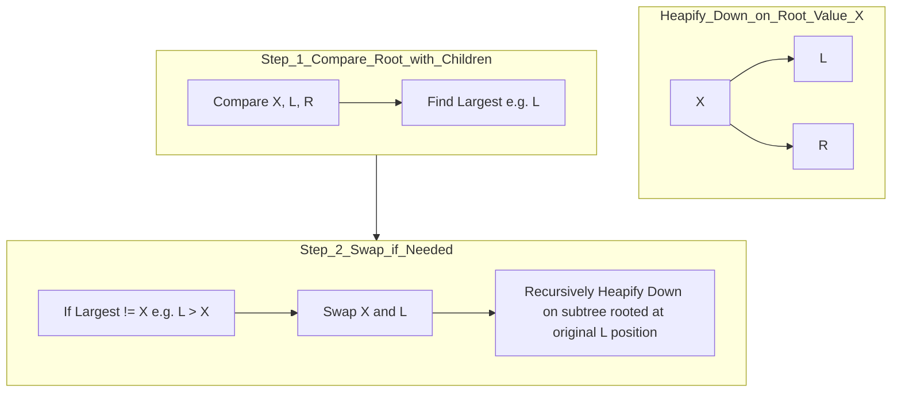

---
tags:
  - algorithms
  - concept
  - sorting
  - comparison_sort
  - in-place
aliases:
  - Heapsort
related:
  - "[[Sorting_Algorithms]]"
  - "[[Comparison_Sort]]"
  - "[[Heap_DS]]"
  - "[[Binary_Tree_DS]]"
  - "[[In-place_Algorithm]]"
  - "[[Time_Complexity]]"
  - "[[O_n_log_n]]"
  - "[[Selection_Sort]]" # Shares idea of finding max/min repeatedly
worksheet: [WS25]
date_created: 2025-04-21
---
# Heap Sort

## Definition

**Heap Sort** is an efficient, [[In-place_Algorithm|in-place]], [[Comparison_Sort|comparison-based]] [[Sorting_Algorithms|sorting algorithm]]. It uses a [[Heap_DS|heap]] data structure (typically a binary max-heap) to manage the elements. The algorithm proceeds in two main phases: first, building a max-heap from the input array, and second, repeatedly extracting the maximum element from the heap (which is always at the root) and placing it at the end of the sorted portion of the array.

## Algorithm Steps

1.  **Build Max-Heap (Heapify):** Rearrange the elements of the input array to satisfy the max-heap property: for every node `i` other than the root, the value of `A[i]` is less than or equal to the value of its parent `A[parent(i)]`. This can be done in O(n) time by starting from the last non-leaf node and calling a "heapify-down" (or "sift-down") procedure for each node upwards to the root.
2.  **Sort Down:** Repeat `n-1` times:
    a.  Swap the root element (the maximum value, `A[0]`) with the last element in the *unsorted* portion of the array (`A[heap_size - 1]`).
    b.  Reduce the considered heap size by one.
    c.  Call "heapify-down" on the new root (`A[0]`) to restore the max-heap property for the reduced heap.

## Key Aspects / Characteristics

- **Time Complexity:** **O(n log n)** in all cases (best, average, worst).
    - Building the initial heap takes O(n).
    - Each of the `n-1` extractions involves swapping (O(1)) and heapifying down (O(log n)). Total O(n log n).
- **Space Complexity:** **O(1)** auxiliary space (if implemented carefully). It is an [[In-place_Algorithm|in-place sort]] as it operates directly on the input array. (Note: Recursive heapify implementations might use O(log n) stack space).
- **Stability:** **Not stable**. Equal elements are not guaranteed to maintain their original relative order.
- **Comparison Sort:** Relies on comparing elements to maintain the heap property.

## Visualization (Conceptual Heapify Down)

## Use Cases

- Useful when guaranteed O(n log n) worst-case time complexity is required.
- Suitable when memory is limited (O(1) space complexity).
- Used as the sorting algorithm within Introsort (a hybrid sort).
- The heap data structure itself (used by Heapsort) is fundamental for implementing [[Priority_Queue_ADT|Priority Queues]].

## Related Concepts
- [[Sorting_Algorithms]], [[Comparison_Sort]], [[In-place_Algorithm]]
- [[Heap_DS]] (The core data structure used)
- [[Time_Complexity]], [[O_n_log_n]]
- [[Stability_Sorting]] (Heapsort is not stable)
- [[Selection_Sort]] (Similar idea of repeatedly finding the max/min, but Heapsort does it more efficiently using the heap structure)

---
**Source:** Worksheet WS25