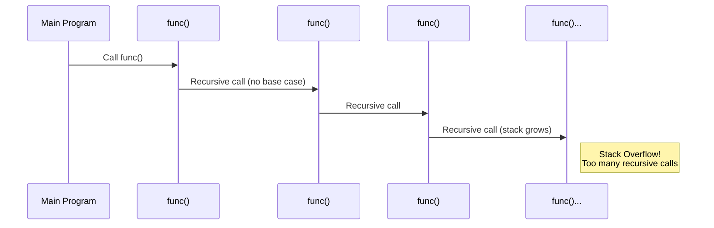

---
tags:
  - c
  - concept
  - error
  - runtime_error
  - memory
  - recursion
  - stack
  - python
aliases:
  - C Stack Overflow
related:
  - "[[Stack_Memory_C]]"
  - "[[Stack_Segment_C]]"
  - "[[Recursion_C]]"
  - "[[Function_Call_C]]"
  - "[[Automatic_Variable_C]]"
  - "[[Segmentation_Fault]]"
  - "[[Operating_System]]"
worksheet:
  - WS10
  - WS13
date_created: 2025-04-14
---
# Stack Overflow (C and Python)

## Definition

A **Stack Overflow** is a runtime error that occurs when a program attempts to use more memory space on the [[Stack_Segment_C|call stack]] than has been allocated for it. The stack has a limited size, and when this limit is exceeded (the stack pointer goes beyond the allocated boundary), a stack overflow happens. In C, this typically causes the program to crash, often with a [[Segmentation_Fault]]. In Python, it often manifests as a `RecursionError` due to exceeding the recursion limit.

## Causes

1.  **Deep [[Recursion_C|Recursion]]:** The most common cause. Each recursive [[Function_Call_C]] pushes a new [[Stack_Frame_C]] onto the stack. If the recursion depth is too large (due to large input, slow convergence to the [[Stop_Condition_C|base case]], or infinite recursion caused by a missing/incorrect base case), the stack space is exhausted.
2.  **Very Large [[Automatic_Variable_C|Automatic (Local) Variables]] (C-specific):** Declaring extremely large arrays or structures as local variables inside a function allocates them on the stack frame for that function. If a single frame (or the cumulative size of frames) exceeds the stack limit, an overflow occurs.
    ```c
    void problematic_function() {
        char large_buffer[2 * 1024 * 1024]; // Request 2MB on the stack - likely overflow!
        // ... use buffer ...
    }
    ```
3.  **Incorrect Stack Pointer Manipulation (C-specific):** (Rare in standard C, more likely in assembly or with compiler bugs) Directly manipulating the stack pointer register incorrectly.
4.  **Exceeding Python’s Recursion Limit:** In Python, the interpreter enforces a default recursion limit (typically 1000). Exceeding this limit during deep recursion raises a `RecursionError`, which is Python’s equivalent of a stack overflow.

## Visualization

The following Mermaid sequence diagram illustrates how deep recursion can lead to a stack overflow, using a simple recursive function as an example:



## Consequences

- **Program Crash (C):** Usually results in abnormal program termination.
- **[[Segmentation_Fault]] (Segfault, C):** On Unix-like systems, attempting to access memory outside the allocated stack segment often triggers a segmentation fault signal (`SIGSEGV`).
- **Stack Smashing / Corruption (C):** In some cases, overflowing the stack might overwrite crucial data in adjacent stack frames (like return addresses or saved registers), potentially leading to unpredictable behavior or security vulnerabilities (stack buffer overflows).
- **RecursionError (Python):** In Python, exceeding the recursion limit raises a `RecursionError`, stopping the program and indicating a stack overflow-like condition.

## Examples

### C Example: Large Stack Allocation

```c
void problematic_function() {
    char large_buffer[2 * 1024 * 1024]; // Request 2MB on the stack - likely overflow!
    // ... use buffer ...
}
```

### Python Example: Infinite Recursion

```python
def infinite_recursion():
    infinite_recursion()  # No base case, will cause RecursionError

# Example usage (will crash)
infinite_recursion()
```

**Output:**
```
RecursionError: maximum recursion depth exceeded
```

### Python Example: Hitting Recursion Limit

```python
def count_down(n):
    if n == 0:
        return  # Base case
    print(n)
    count_down(n - 1)

# Example usage with a large number
count_down(2000)  # Exceeds Python's default recursion limit of 1000
```

**Output:**
```
2000
1999
...
1001
RecursionError: maximum recursion depth exceeded while calling a Python object
```

## Prevention / Mitigation

- **Avoid Deep/Infinite Recursion:** Ensure recursive functions have correct, reachable base cases. Consider iterative solutions if recursion depth might be very large. Use [[Tail_Recursion_C|tail recursion]] optimization if supported and applicable (though not guaranteed in C, and Python does not optimize tail recursion).
- **Avoid Very Large Stack Allocations (C):** Allocate large arrays or structures dynamically on the [[Heap_Memory_C]] using [[malloc]] instead of declaring them as local variables.
- **Increase Stack Size (C, If Possible):** Some operating systems or compiler/linker settings allow increasing the default stack size allocated per thread or process, but this is often a workaround rather than a fix for the underlying problem.
- **Adjust Recursion Limit (Python):** In Python, you can increase the recursion limit using `sys.setrecursionlimit()`, but this is not recommended for production as it may lead to a true stack overflow. Prefer iterative solutions for deep recursion.
    ```python
    import sys
    sys.setrecursionlimit(2000)  # Increase limit to 2000 (use with caution)
    ```

## Related Concepts
- [[Stack_Memory_C]], [[Stack_Segment_C]] (The memory region that overflows)
- [[Recursion_C]] (Common cause)
- [[Function_Call_C]], [[Stack_Frame_C]] (Stack usage mechanism)
- [[Automatic_Variable_C]] (Large ones can cause overflow in C)
- [[Segmentation_Fault]] (Common symptom in C)
- [[Heap_Memory_C]], [[Dynamic_Allocation_C]] (Alternative for large data in C)
- [[Operating_System]] (Manages process memory, including stack limits)

## Questions / Further Study
>[!question] What is a stack overflow error? What causes it? (WS13)
> A stack overflow error is a runtime error occurring when a program tries to use more memory on the call [[Stack_Segment_C|stack]] than is available. It's primarily caused by:
> 1.  **Deep or Infinite [[Recursion_C]]:** Too many nested function calls consume all available stack space for their [[Stack_Frame_C|stack frames]].
> 2.  **Large [[Automatic_Variable_C|Local Variables]] (C):** Declaring excessively large arrays or structs as local variables within functions can exceed the stack limit.
> 3.  **Exceeding Recursion Limit (Python):** In Python, deep recursion exceeding the default limit (1000) raises a `RecursionError`.

---
**Source:** Worksheet WS10, WS13