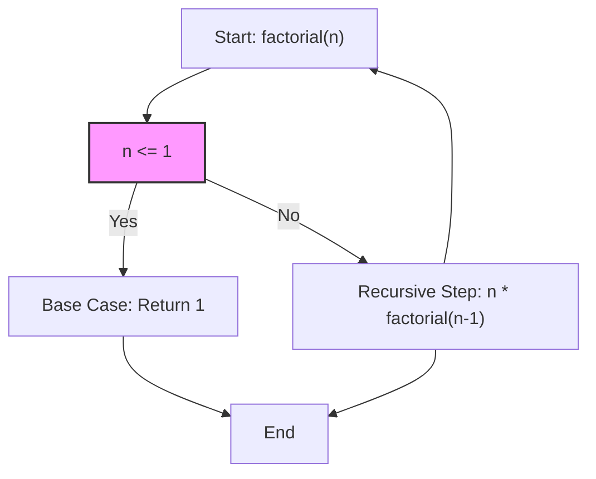

---
tags:
  - algorithms
  - concept
  - recursion
  - control_flow
  - c
  - python
aliases:
  - Base Case C
  - Recursion Base Case
  - Termination Condition
related:
  - "[[Recursion_C]]"
  - "[[Function_C]]"
  - "[[Stack_Overflow]]"
  - "[[Infinite_Loop]]"
worksheet:
  - WS10
date_created: 2025-04-14
---
# Stop Condition (Recursion Base Case, C and Python)

## Definition

In a [[Recursion_C|recursive function]], the **Stop Condition**, more commonly called the **Base Case**, is the condition under which the function **stops calling itself** and instead returns a value directly (or performs a final action without recursion). It represents the simplest version of the problem that can be solved without further decomposition.

## Importance

- **Prevents Infinite Recursion:** The base case is absolutely essential to prevent a recursive function from calling itself indefinitely. Without a base case that is eventually reached, the function calls would continue until the [[Stack_Memory_C|call stack]] runs out of memory, causing a [[Stack_Overflow]].
- **Defines the Solution's Foundation:** Provides the known, simple solution upon which the solutions to larger, more complex subproblems are built as the recursion unwinds.
- **Termination Guarantee:** A correctly defined base case, combined with a recursive step that consistently moves the problem closer to the base case, guarantees that the recursion will eventually terminate.

## Characteristics

- **Simple Case:** Represents the smallest or simplest instance of the problem.
- **Direct Solution:** The function can compute and return the result for the base case without making any further recursive calls.
- **Reachable:** The recursive step(s) must modify the problem state in such a way that a base case is guaranteed to be reached eventually for all valid inputs.
- **Multiple Base Cases:** A recursive function can have more than one base case.

## Visualization

The following Mermaid flowchart illustrates the decision-making process in a recursive factorial function, highlighting the base case:




## Examples

### C Example: Factorial

```c
long long factorial(int n) {
    // Base Case
    if (n <= 1) {
        return 1;
    }
    // Recursive Step
    return n * factorial(n - 1);
}
```

- **Base Case:** `n <= 1`, returns `1`.
- **Recursive Step:** `n * factorial(n - 1)`, reducing `n` until the base case is reached.

### Python Example: Factorial

```python
def factorial(n):
    # Base Case
    if n <= 1:
        return 1
    # Recursive Step
    return n * factorial(n-1)
```

- **Base Case:** `n <= 1`, returns `1`.
- **Recursive Step:** `n * factorial(n-1)`, reducing `n` until the base case is reached.

### C Example: Binary Search

```c
int binary_search(int arr[], int low, int high, int target) {
    // Base Case 1: Element not found
    if (low > high) {
        return -1;
    }
    int mid = low + (high - low) / 2;
    // Base Case 2: Element found
    if (arr[mid] == target) {
        return mid;
    }
    // Recursive Step
    if (arr[mid] > target) {
        return binary_search(arr, low, mid - 1, target); // Left half
    } else {
        return binary_search(arr, mid + 1, high, target); // Right half
    }
}
```

- **Base Case 1:** `low > high`, returns `-1` (element not found).
- **Base Case 2:** `arr[mid] == target`, returns `mid` (element found).
- **Recursive Step:** Recurse on the left or right half, reducing the search range.

### Python Example: Binary Search

```python
def binary_search(arr, low, high, target):
    # Base Case 1: Element not found
    if low > high:
        return -1
    mid = (low + high) // 2
    # Base Case 2: Element found
    if arr[mid] == target:
        return mid
    # Recursive Step
    if arr[mid] > target:
        return binary_search(arr, low, mid - 1, target)  # Left half
    return binary_search(arr, mid + 1, high, target)  # Right half

# Example usage
arr = [2, 3, 4, 10, 40]
target = 10
result = binary_search(arr, 0, len(arr)-1, target)
print(f"Element {target} found at index: {result}")  # Output: Element 10 found at index: 3
```

- **Base Case 1:** `low > high`, returns `-1`.
- **Base Case 2:** `arr[mid] == target`, returns `mid`.
- **Recursive Step:** Recurse on the left or right half, reducing the search range.

## Related Concepts
- [[Recursion_C]] (Base case is fundamental to recursion)
- [[Stack_Overflow]] (Result of missing or incorrect base case)
- [[Function_C]]
- [[Infinite_Loop]] (Analogous problem in iterative structures)

---
**Source:** Worksheet WS10
