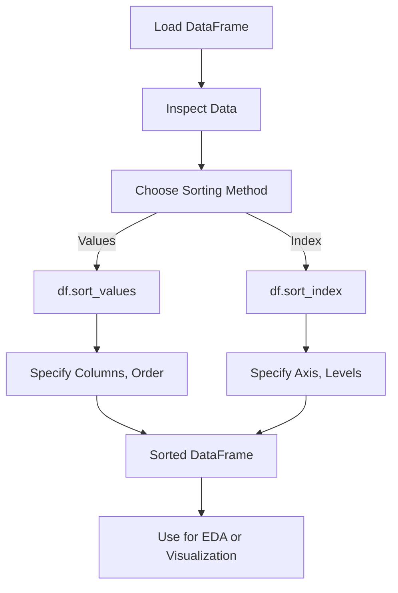

# Pandas Sorting Data

## Definition

Sorting in [[Pandas]] involves reordering data in a [[Pandas_DataFrame]] or [[Pandas_Series]] based on specific columns, index values, or other criteria. The primary methods are `df.sort_values()` for sorting by column or row values and `df.sort_index()` for sorting by index.

## Key Aspects / Characteristics

- **Sorting by Values (`df.sort_values`)**: Orders data based on one or more columns or rows, with control over ascending/descending order and handling of missing values.
- **Sorting by Index (`df.sort_index`)**: Reorders data based on the index (row or column labels), useful for [[Pandas_MultiIndex]] or time series data.
- **Flexibility**: Both methods support parameters like `inplace` for modifying the DataFrame directly, `na_position` for handling [[Pandas_Representing_Missing_Values]], and `kind` for selecting sorting algorithms.
- **Use Cases**: Sorting is critical for [[Exploratory_Data_Analysis_Workflow|EDA]], preparing data for visualization, or ensuring consistent ordering for downstream processing.

## Examples / Use Cases

[list2tab]
- Values
  [list2mdtable]
  - Description:
    - Code:
      - ```python
        import pandas as pd
        df = pd.DataFrame({'name': ['Alice', 'Bob', 'Charlie', 'David'], 'age': [25, 30, 20, 35], 'score': [90, 85, 95, 80]})
        sorted_df = df.sort_values(by='age', ascending=True)
        print(sorted_df)
        ```
    - Output:
      - ```
        name  age  score
        2  Charlie   20     95
        0    Alice   25     90
        1      Bob   30     85
        3    David   35     80
        ```

- Index
  [list2mdtable]
  - Description:
    - Code:
      - ```python
        import pandas as pd
        df = pd.DataFrame({'value': [10, 20, 30, 40]}, index=['d', 'a', 'c', 'b'])
        sorted_df = df.sort_index(ascending=True)
        print(sorted_df)
        ```
    - Output:
      - ```
        value
        a     20
        b     40
        c     30
        d     10
        ```

## Method Details


---


[list2table]
- Method:
  - Signature:
    - `df.sort_values(by, axis=0, ascending=True, inplace=False, kind='quicksort', na_position='last')`
  - Parameters:
    - `by`: Column name(s) or index level(s) to sort by (str or list).
    - `axis`: 0 for rows (default), 1 for columns.
    - `ascending`: True (default) for ascending, False for descending.
    - `inplace`: If True, modifies the DataFrame in place.
    - `kind`: Sorting algorithm ('quicksort', 'mergesort', 'heapsort').
    - `na_position`: 'first' or 'last' (default) for missing values.
  - Returns:
    - Sorted [[Pandas_DataFrame]] or None (if `inplace=True`).

- Method:
  - Signature:
    - `df.sort_index(axis=0, level=None, ascending=True, inplace=False, kind='quicksort', na_position='last', sort_remaining=True)`
  - Parameters:
    - `axis`: 0 for row index (default), 1 for column index.
    - `level`: For [[Pandas_MultiIndex]], specify level(s) to sort.
    - `ascending`: True (default) or False.
    - `inplace`: If True, modifies in place.
    - `kind`: Sorting algorithm.
    - `na_position`: Position of NaN.
    - `sort_remaining`: If True, sorts remaining levels in [[Pandas_MultiIndex]].
  - Returns:
    - Sorted [[Pandas_DataFrame]] or None (if `inplace=True`).
    
## List2MDtable

  [list2mdtable]
  - Description:
    - Code:
      - ```python
        import pandas as pd
        df = pd.DataFrame({'value': [10, 20, 30, 40]}, index=['d', 'a', 'c', 'b'])
        sorted_df = df.sort_index(ascending=True)
        print(sorted_df)
        ```
    - Output:
      - 
       ```
        value
        a     20
        b     40
        c     30
        d     10
	    ```


## List2table

  [list2table]
  - Description:
    - Code:
      - ```python
        import pandas as pd
        df = pd.DataFrame({'value': [10, 20, 30, 40]}, index=['d', 'a', 'c', 'b'])
        sorted_df = df.sort_index(ascending=True)
        print(sorted_df)
        ```
    - Output:
      - 
      ```
        value
        a     20
        b     40
        c     30
        d     10
		```

## Method Details


## Diagrams

[mermaid]


## Questions / Further Study

> [!question] How does `df.sort_values` handle missing values?
> By default, `na_position='last'` places [[Pandas_Representing_Missing_Values|NaN]] values at the end of the sorted order. Setting `na_position='first'` moves them to the start. This is critical for consistent data analysis in [[Exploratory_Data_Analysis_Workflow|EDA]].

> [!question] What sorting algorithms are available in Pandas?
> The `kind` parameter supports 'quicksort' (default, see [[Sorting_Algorithms]]), 'mergesort' (stable, see [[Stability_Sorting]]), and 'heapsort' (see [[Heap_Sort]]). 'mergesort' is preferred for stable sorting.

---
[list2markmap]
- was ist das
- keine ahnung
	- schau doch